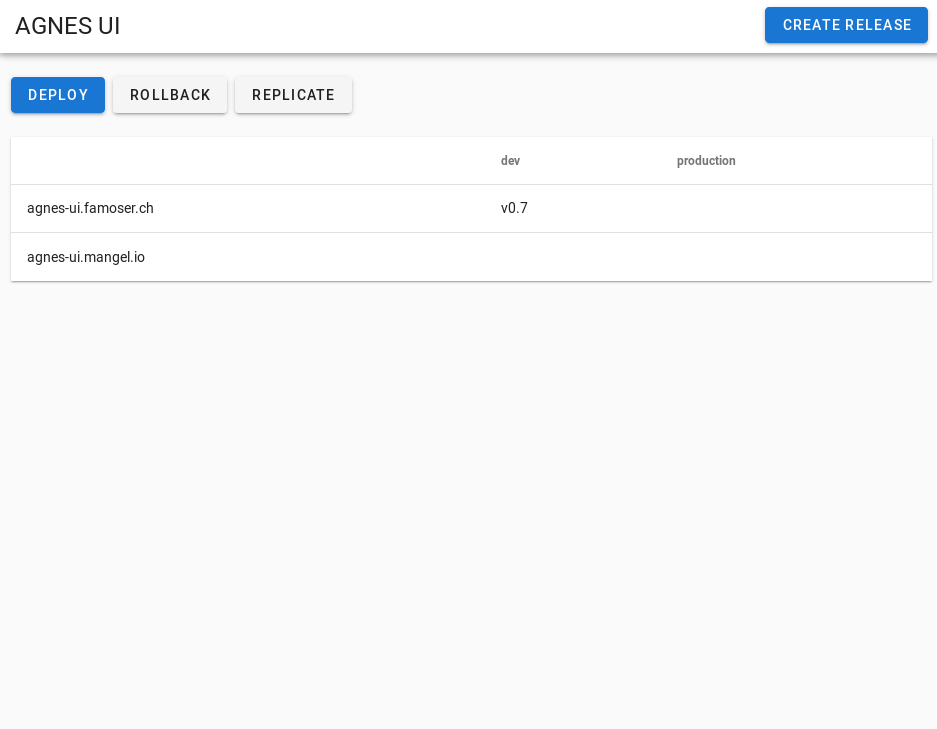
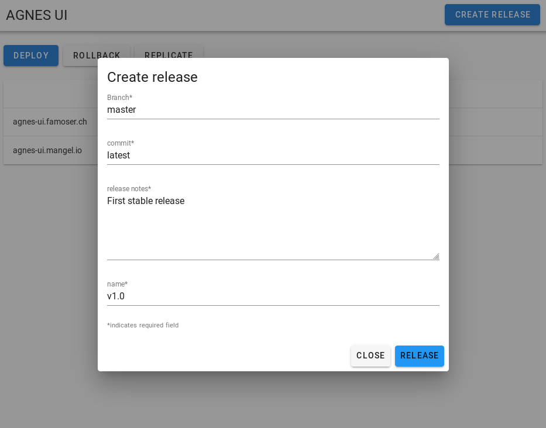
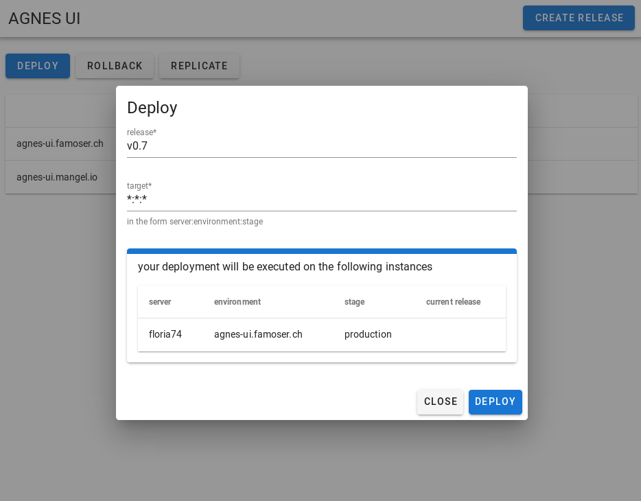
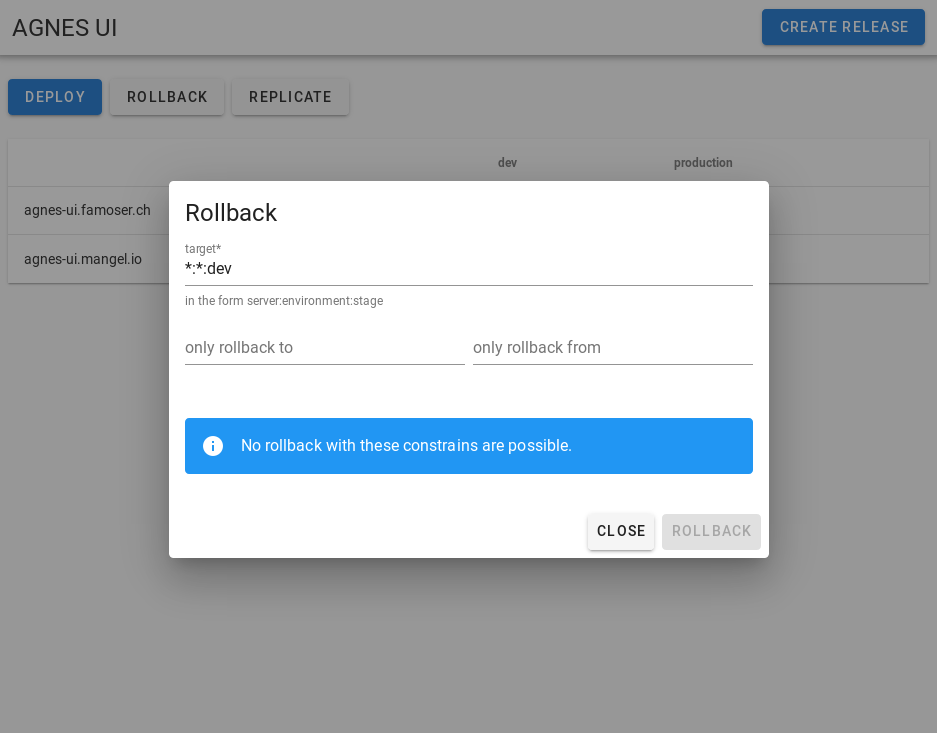
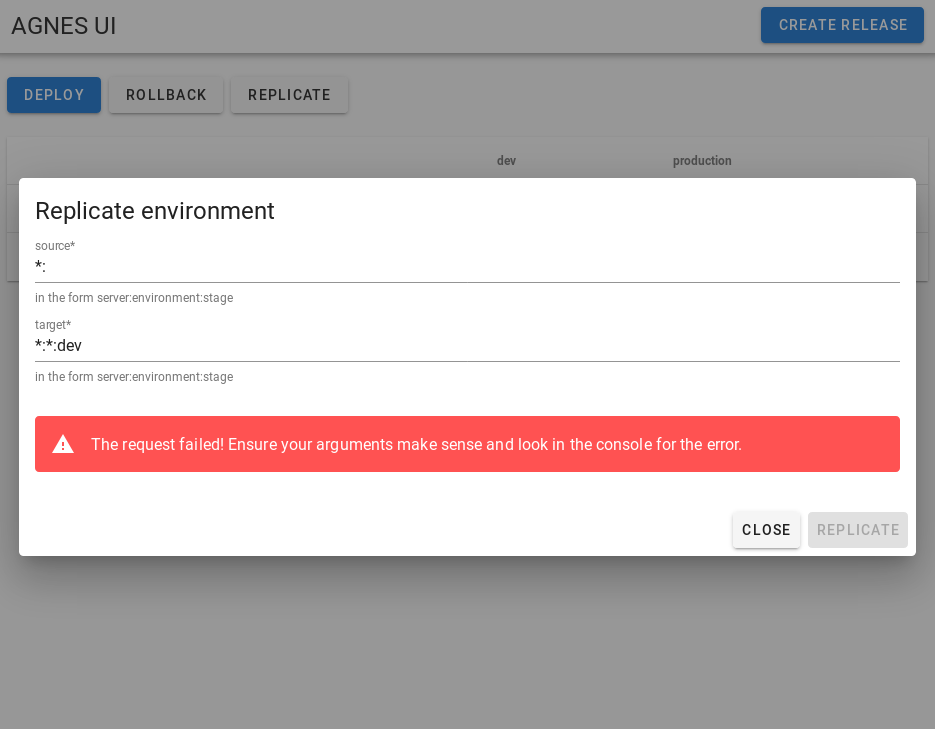

# Agnes UI

This UI allows to use the deploy tool [famoser/agnes-ui](https://github.com/famoser/agnes) with ease.

- Create releases with release notes 
- Know exactly which version of the application is installed where
- Deploy new releases to environments
- Rollback the release if something is odd
- Copy shared data to another environment (effectively replicate another environment)

## Configuration

Set `TARGET_REPOSITORY` to the repository you want to deploy. 
The deployment uses [famoser/agnes-ui](https://github.com/famoser/agnes) under the hood (obviously), head over there to find our how to configure agnes property.

(optional) Set `CONFIG_REPOSITORY` to the repository with additional agnes configuration.
Again, find out over at [famoser/agnes-ui](https://github.com/famoser/agnes) how this should look like.
If you have the agnes config in a subfolder, you can set the `CONFIG_REPOSITORY_FOLDER` value.

Set `GITHUB_API_TOKEN` to a valid github token (generate a new one at https://github.com/settings/tokens).

## Screenshots

___

___

___

___

